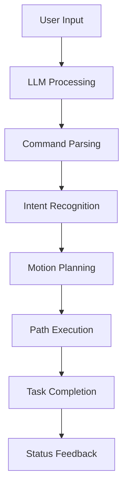

# LLM-Enhanced Robotic Manipulation System

🤖 **An Intelligent Robotics System Integrating Large Language Models with Panda Robot for Complex Manipulation Tasks**

## 🎯 Project Overview

Our project is designed to utilize the Panda robot for intelligent path planning to solve two primary manipulation problems:

1. **Cup Placement Task**: Precisely placing an empty cup on a coaster
2. **Block Stacking Task**: Systematically stacking three colored blocks in a specific sequence

The system features **randomly generated themes**, requiring the robot to intelligently determine correct target locations and complete tasks autonomously. The highlight of our project lies in the innovative integration of **Large Language Model (LLM) systems**, enabling users to control the robot through natural language input in both English and Chinese.

## 🚀 Key Features

### 🧠 Intelligent Planning Methods
- **Sampling-based Algorithms**: Utilizing the [Open Motion Planning Library (OMPL)](https://ompl.kavrakilab.org/) for robust path planning
- **Screw Motion Planning**: Advanced trajectory generation through:
  - Relative transformation calculation from current to target pose
  - Exponential coordinates computation of relative transformations
  - Joint velocity calculation using Jacobian matrix methods

### 🗣️ Natural Language Interface
- **Multi-language Support**: Natural English and Chinese command processing
- **LLM Integration**: DeepSeek API integration with local fallback
- **Intuitive Control**: Users can command the robot using everyday language
- **Smart Parsing**: Advanced command interpretation with confidence scoring

### 🎮 Dual Task Capabilities
- **Cup Placement Environment**: Precise manipulation for tableware organization
- **Block Stacking Environment**: Complex multi-object manipulation with spatial reasoning

## 📁 Project Structure

```
copy_Robotwin/
├── envs/
│   ├── llm_enhanced_stack.py      # LLM-integrated block stacking system
│   ├── demo_stack.py              # Core block stacking implementation
│   ├── llm_interface.py           # LLM communication interface
│   ├── camera.py                  # Camera and vision systems
│   ├── robot.py                   # Robot control and kinematics
│   └── utils.py                   # Utility functions
├── config/
│   └── llm_config.py              # LLM and system configuration
├── assets/                        # 3D models and textures
├── requirements.txt               # Dependencies
└── README.md                      # This file
```

## 🛠️ Installation

### Prerequisites
- Python 3.10+
- CUDA-capable GPU (recommended)
- Linux/Ubuntu 22.04+ (recommended)

### Step 1: Environment Setup
```bash
# Create conda environment
conda create -n robotwin_env python=3.9
conda activate robotwin_env

# Clone repository
git clone <your-repo-url>
cd copy_Robotwin
```

### Step 2: Install Dependencies
```bash
# Install PyTorch with CUDA support
pip install torch torchvision --index-url https://download.pytorch.org/whl/cu121

# Install SAPIEN simulation framework
pip install sapien

# Install remaining dependencies
pip install -r requirements.txt
```

### Step 3: Install Motion Planning Library
```bash
# Install MPLib for motion planning
pip install mplib
```

## ⚙️ Configuration

### LLM Setup (Optional but Recommended)
1. **DeepSeek API Configuration**:
   ```python
   # In config/llm_config.py
   DEFAULT_LLM_CONFIG = {
       "type": "deepseek",
       "api_key": "your-deepseek-api-key-here",  # Replace with actual key
       "model": "deepseek-chat",
       "base_url": "https://api.deepseek.com"
   }
   ```

2. **Local Mode**: If no API key is provided, the system automatically falls back to local keyword matching.

## 🎮 Usage

### Block Stacking Task with LLM Integration

```bash
cd copy_Robotwin
python -c "
from envs.llm_enhanced_stack import LLMEnhancedStackEnvironment

# Initialize environment
env = LLMEnhancedStackEnvironment()
env.create_environment()

# Start interactive mode
env.interactive_mode()
"
```

### Interactive Commands

Once in interactive mode, you can use natural language commands:

#### 🧱 Block Stacking Commands
```
🎯 Natural Language Examples:
• "Stack all blocks"
• "叠加所有方块"
• "Pile up the blocks"
• "将方块堆起来"
```

#### 🔧 Robot Control Commands
```
• "Open gripper" / "打开夹爪"
• "Close gripper" / "关闭夹爪"  
• "Go home" / "回到初始位置"
• "Show status" / "显示状态"
• "Reset scene" / "重置场景"
```

#### 📋 System Commands
```
• help/h - Show help information
• status/s - Display environment status
• history - Show task execution history
• clear - Clear screen
• quit/q - Exit program
```

### Example Session
```
🤖 欢迎使用LLM增强的方块叠加系统！

🎯 请输入指令> Stack all the blocks
📝 用户输入: Stack all the blocks
🔍 解析结果: 按默认顺序叠加所有方块 (信心度: 0.90)
🤖 正在执行任务...
开始规划方块叠加任务...
=== 阶段1：将方块2叠加到方块1上 ===
步骤1: 移动到方块2上方...
... (detailed execution steps)
✅ 任务执行成功!
```

## 🏗️ System Architecture

### Core Components

1. **LLMEnhancedStackEnvironment**: Main system integrating LLM with robotics
2. **Motion Planning Pipeline**:
   - OMPL-based sampling algorithms
   - Screw motion trajectory generation
   - Collision detection and avoidance
3. **Natural Language Processing**:
   - Command parsing and intent recognition
   - Confidence scoring and validation
   - Multi-language support

### Task Execution Flow



## 🎨 Supported Tasks

### 1. Block Stacking Task
- **Objective**: Stack three colored blocks (Red→Green→Blue)
- **Complexity**: Multi-stage manipulation with precise positioning
- **Features**: 
  - Automatic block detection
  - Collision-free path planning
  - Stable stacking sequences

### 2. Cup Placement Task (Future Enhancement)
- **Objective**: Place cups on designated coasters
- **Features**: Precision placement with orientation control

## 🔧 Technical Details

### Motion Planning Algorithms
1. **OMPL Integration**: Utilizes RRT*, PRM, and other sampling-based algorithms
2. **Screw Motion Theory**: Implements SE(3) motion planning with:
   - Lie algebra exponential mapping
   - Jacobian-based velocity control
   - Smooth trajectory interpolation

### LLM Integration
- **Primary**: DeepSeek API for advanced natural language understanding
- **Fallback**: Local keyword matching for offline operation
- **Confidence Scoring**: Ensures reliable command interpretation

## 🐛 Troubleshooting

### Common Issues

1. **SAPIEN Installation Errors**:
   ```bash
   # Try installing with specific version
   pip install sapien==3.0.0b1
   ```

2. **CUDA/GPU Issues**:
   ```bash
   # Install CPU-only PyTorch if GPU unavailable
   pip install torch torchvision --index-url https://download.pytorch.org/whl/cpu
   ```

3. **Motion Planning Failures**:
   - Check joint limits and workspace boundaries
   - Verify collision meshes are properly loaded
   - Increase planning timeout in configuration

## 🤝 Contributing

We welcome contributions! Please follow these steps:

1. Fork the repository
2. Create a feature branch (`git checkout -b feature/amazing-feature`)
3. Commit your changes (`git commit -m 'Add amazing feature'`)
4. Push to the branch (`git push origin feature/amazing-feature`)
5. Open a Pull Request

## 📄 License

This project is licensed under the MIT License - see the [LICENSE](LICENSE) file for details.

## 🙏 Acknowledgments

- **SAPIEN Simulation Platform**: For providing the physics simulation environment
- **MPLib**: For motion planning algorithms and implementations
- **DeepSeek**: For LLM API services
- **Open Motion Planning Library (OMPL)**: For sampling-based planning algorithms

## 📞 Contact

For questions, issues, or collaborations, please contact:
- **Project Lead**: [Marcos] - [marcus20220122@gmail.com]
- **Issues**: [GitHub Issues](link-to-issues)
- **Discussions**: [GitHub Discussions](link-to-discussions)

---

🚀 **Ready to explore intelligent robotics with natural language control? Get started now!**
